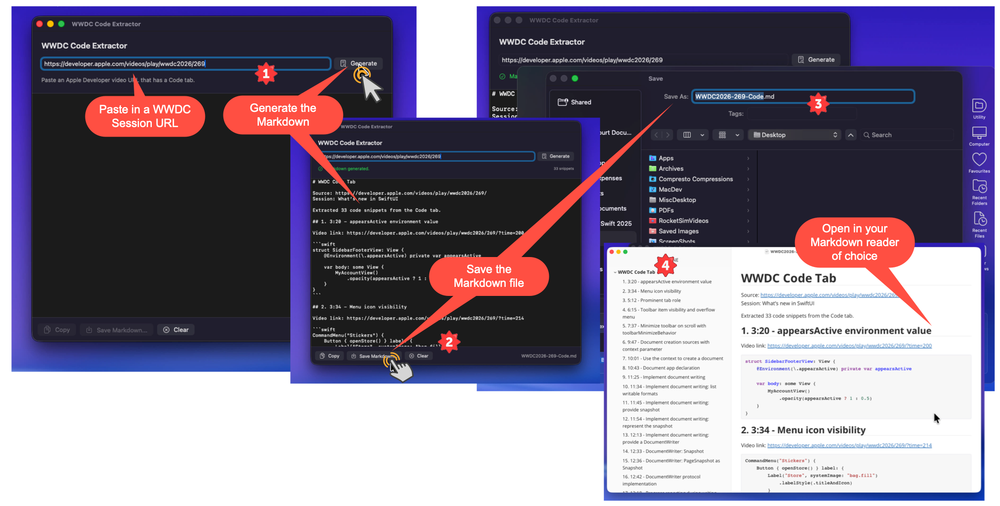

# WWDC Code Extractor

## If you downloaded the release 1.0.0, make sure you update to v1.1.0 as the Apple Developer site changed the url on the Developer page for the session code.


WWDC Code Extractor is a small macOS SwiftUI utility that turns the Code tab from an Apple Developer video page into a single Markdown file.



Paste a URL like:

```text
https://developer.apple.com/videos/play/wwdc2025/245
```

If the video page includes a Code tab, the app fetches the page, extracts every code snippet, and generates Markdown with snippet titles, timestamps, video links, and Swift fenced code blocks.

## Download

Download the latest signed DMG from the GitHub Releases page:

[Download WWDC Code Extractor](https://github.com/StewartLynch/WWDCCodeExtractor/releases/latest)

## Features

- Paste an Apple Developer video URL.
- Generate Markdown from the page's Code tab.
- Preview the generated Markdown in the app.
- Copy the Markdown to the clipboard.
- Save the Markdown as an `.md` file.
- Uses only Apple frameworks; no third-party dependencies.

## Requirements

To run a built copy of the app:

- macOS 14 or later.
- Internet access.

To build from source:

- macOS with a compatible version of Xcode installed.
- Xcode 16 or later is recommended.
- Internet access for testing extraction from live Apple Developer pages.

No Apple Developer account, OpenAI API key, package manager, or external dependency is required.

## Build and Run

1. Open `WWDCCodeExtractor.xcodeproj` in Xcode.
2. Select the `WWDCCodeExtractor` scheme.
3. Choose **Product > Run**, or press `Command-R`.

You can also build from Terminal:

```bash
xcodebuild -project WWDCCodeExtractor.xcodeproj -scheme WWDCCodeExtractor -configuration Debug build
```

## Usage

1. Launch the app.
2. Paste an Apple Developer video URL into the text field.
3. Click **Generate**.
4. Review the generated Markdown.
5. Click **Copy** or **Save Markdown...**.

The saved filename is suggested from the WWDC event and session number, such as:

```text
WWDC2026-269-Code.md
```

## Sharing the App

If you share the built `.app` bundle directly, recipients only need macOS 14 or later and internet access.

If the app is not signed and notarized, macOS Gatekeeper may warn recipients the first time they open it. They can usually right-click the app, choose **Open**, and confirm. For a smoother distribution experience, sign and notarize the app with an Apple Developer account.

## How It Works

The extractor downloads the Apple Developer video HTML, searches for Code tab snippet containers, removes Apple's syntax-highlight HTML, decodes HTML entities, and renders the result as Markdown.

Each extracted snippet is written as:

````markdown
## 1. 3:20 - Snippet title

Video link: https://developer.apple.com/videos/play/wwdc2026/269/?time=200

```swift
// snippet code
```
````

## Limitations

- The app depends on the current Apple Developer video page markup.
- Videos without a Code tab will show a "No Code tab snippets were found" message.
- The generated code fence language is currently `swift`, since WWDC Code tabs for this use case are Swift-focused.
- The app fetches live pages and does not cache results.

## Project Structure

```text
WWDCCodeExtractor/
  WWDCCodeExtractor.xcodeproj
  WWDCCodeExtractor/
    WWDCCodeExtractorApp.swift
    CodeExtractorView.swift
    CodeTabExtractor.swift
```

- `WWDCCodeExtractorApp.swift` defines the SwiftUI app entry point.
- `CodeExtractorView.swift` contains the main window UI and view model.
- `CodeTabExtractor.swift` handles URL normalization, page fetching, snippet extraction, HTML cleanup, and Markdown rendering.
